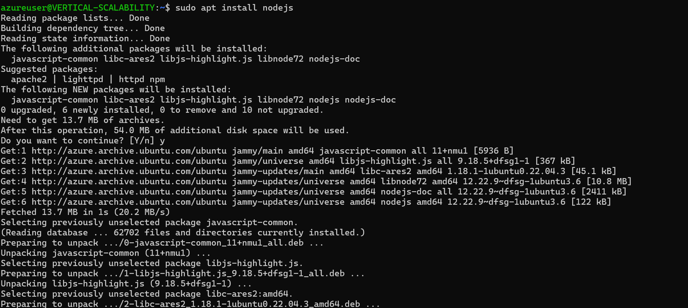
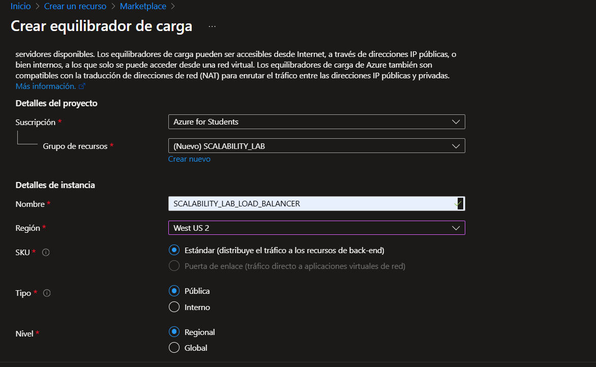
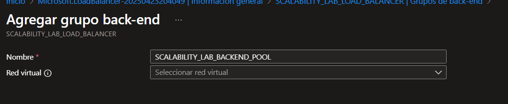
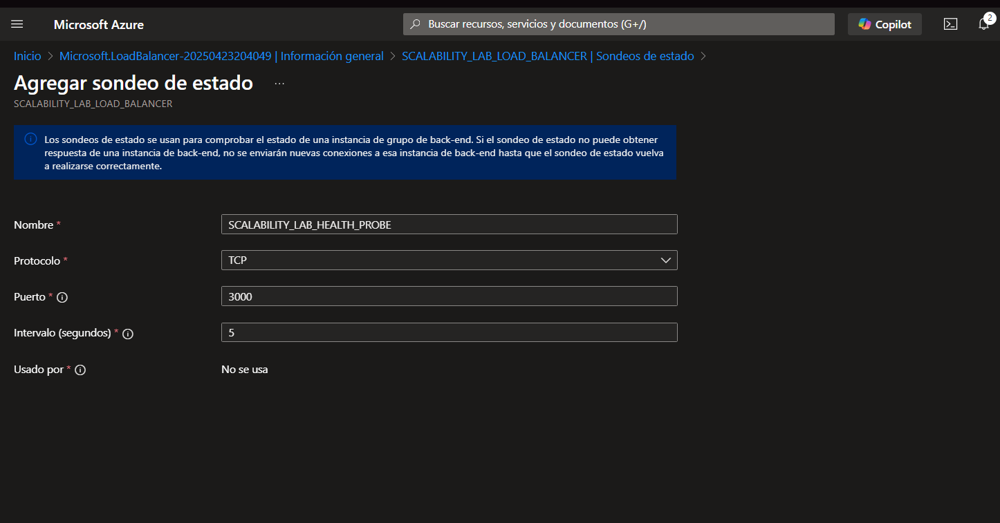
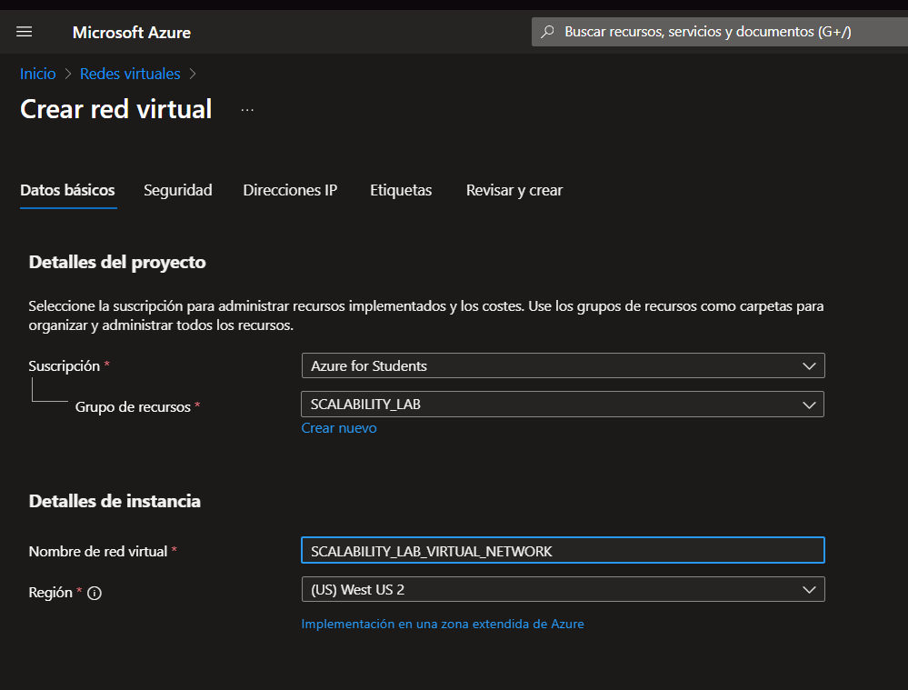
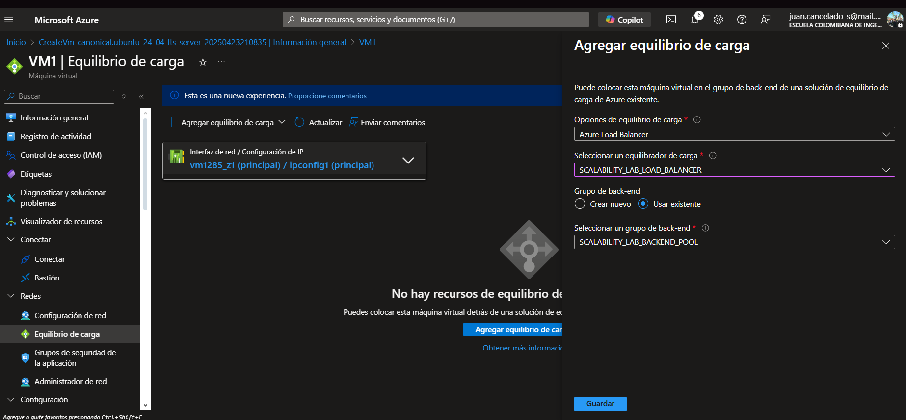

### Escuela Colombiana de Ingeniería
### Arquitecturas de Software - ARSW

## Escalamiento en Azure con Maquinas Virtuales, Sacale Sets y Service Plans

# Integrantes: Juan Cancelado y Diego Chicuazuque

### Dependencias
* Cree una cuenta gratuita dentro de Azure. Para hacerlo puede guiarse de esta [documentación](https://azure.microsoft.com/es-es/free/students/). Al hacerlo usted contará con $100 USD para gastar durante 12 meses.

### Parte 0 - Entendiendo el escenario de calidad

Adjunto a este laboratorio usted podrá encontrar una aplicación totalmente desarrollada que tiene como objetivo calcular el enésimo valor de la secuencia de Fibonnaci.

**Escalabilidad**
Cuando un conjunto de usuarios consulta un enésimo número (superior a 1000000) de la secuencia de Fibonacci de forma concurrente y el sistema se encuentra bajo condiciones normales de operación, todas las peticiones deben ser respondidas y el consumo de CPU del sistema no puede superar el 70%.

### Parte 1 - Escalabilidad vertical

1. Diríjase a el [Portal de Azure](https://portal.azure.com/) y a continuación cree una maquina virtual con las características básicas descritas en la imágen 1 y que corresponden a las siguientes:
    * Resource Group = SCALABILITY_LAB
    * Virtual machine name = VERTICAL-SCALABILITY
    * Image = Ubuntu Server 
    * Size = Standard B1ls
    * Username = scalability_lab
    * SSH publi key = Su llave ssh publica


Resultado:

En esta parte lo que hicimos fue crear una maquina virtual tal cual como nos pide la imagen


maquina realizada:


2. Para conectarse a la VM use el siguiente comando, donde las `x` las debe remplazar por la IP de su propia VM (Revise la sección "Connect" de la virtual machine creada para tener una guía más detallada).

    `ssh scalability_lab@xxx.xxx.xxx.xxx`

En este paso tocaba conectarnos a la maquina virtual:


3. Instale node, para ello siga la sección *Installing Node.js and npm using NVM* que encontrará en este [enlace](https://linuxize.com/post/how-to-install-node-js-on-ubuntu-18.04/).

En este paso instalamos npm:



4. Para instalar la aplicación adjunta al Laboratorio, suba la carpeta `FibonacciApp` a un repositorio al cual tenga acceso y ejecute estos comandos dentro de la VM:

    `git clone <your_repo>`

    `cd <your_repo>/FibonacciApp`

    `npm install`


hicimos el comando npm install


5. Para ejecutar la aplicación puede usar el comando `npm FibinacciApp.js`, sin embargo una vez pierda la conexión ssh la aplicación dejará de funcionar. Para evitar ese compartamiento usaremos *forever*. Ejecute los siguientes comando dentro de la VM.

    ` node FibonacciApp.js`


6. Antes de verificar si el endpoint funciona, en Azure vaya a la sección de *Networking* y cree una *Inbound port rule* tal como se muestra en la imágen. Para verificar que la aplicación funciona, use un browser y user el endpoint `http://xxx.xxx.xxx.xxx:3000/fibonacci/6`. La respuesta debe ser `The answer is 8`.


probamos el resultado en nuestro navegador:


7. La función que calcula en enésimo número de la secuencia de Fibonacci está muy mal construido y consume bastante CPU para obtener la respuesta. Usando la consola del Browser documente los tiempos de respuesta para dicho endpoint usando los siguintes valores:
    * 1000000
    * 1010000
    * 1020000
    * 1030000
    * 1040000
    * 1050000
    * 1060000
    * 1070000
    * 1080000
    * 1090000    

Probando los resultados:


8. Dírijase ahora a Azure y verifique el consumo de CPU para la VM. (Los resultados pueden tardar 5 minutos en aparecer).


Resultados:


9. Ahora usaremos Postman para simular una carga concurrente a nuestro sistema. Siga estos pasos.
    * Instale newman con el comando `npm install newman -g`. Para conocer más de Newman consulte el siguiente [enlace](https://learning.getpostman.com/docs/postman/collection-runs/command-line-integration-with-newman/).
    * Diríjase hasta la ruta `FibonacciApp/postman` en una maquina diferente a la VM.
    * Para el archivo `[ARSW_LOAD-BALANCING_AZURE].postman_environment.json` cambie el valor del parámetro `VM1` para que coincida con la IP de su VM.
    * Ejecute el siguiente comando.

    ```
    newman run ARSW_LOAD-BALANCING_AZURE.postman_collection.json -e [ARSW_LOAD-BALANCING_AZURE].postman_environment.json -n 10 &
    newman run ARSW_LOAD-BALANCING_AZURE.postman_collection.json -e [ARSW_LOAD-BALANCING_AZURE].postman_environment.json -n 10
    ```

Cambios:


10. La cantidad de CPU consumida es bastante grande y un conjunto considerable de peticiones concurrentes pueden hacer fallar nuestro servicio. Para solucionarlo usaremos una estrategia de Escalamiento Vertical. En Azure diríjase a la sección *size* y a continuación seleccione el tamaño `B2ms`.


Resultados:


tamaño:


11. Una vez el cambio se vea reflejado, repita el paso 7, 8 y 9.


12. Evalue el escenario de calidad asociado al requerimiento no funcional de escalabilidad y concluya si usando este modelo de escalabilidad logramos cumplirlo.

/RTA
Sí, porque al incrementar el tamaño de la máquina virtual, también se incrementan los recursos como la CPU y la memoria RAM, lo que permite que la aplicación atienda más solicitudes en un menor tiempo.

13. Vuelva a dejar la VM en el tamaño inicial para evitar cobros adicionales.

**Preguntas**

1. ¿Cuántos y cuáles recursos crea Azure junto con la VM?

/RTA


2. ¿Brevemente describa para qué sirve cada recurso?
/RTA
Dirección IP pública: Este tipo de dirección permite que los recursos en Azure se conecten tanto con Internet como con servicios públicos de Azure. La dirección permanece asignada al recurso (como una máquina virtual) hasta que se libera.

Grupo de seguridad de red: En Azure, puedes utilizar un grupo de seguridad de red para controlar el tráfico que entra y sale de los recursos dentro de una red virtual. Estos grupos incluyen reglas que permiten o bloquean el tráfico según parámetros como el origen, el destino, el puerto y el protocolo.

Red Virtual (Virtual Network):
Una Red Virtual en Azure es la base de una red privada dentro de la nube. Permite que diferentes recursos, como máquinas virtuales, se comuniquen de manera segura entre ellos, con Internet y con redes locales. Funciona de forma similar a una red tradicional en un centro de datos propio, pero con las ventajas de Azure, como escalabilidad, alta disponibilidad y aislamiento.

Interfaz de Red (Network Interface):
La interfaz de red (NIC) es el componente que permite a una máquina virtual conectarse con otros recursos en Azure, con redes locales y con Internet. Cuando se crea una VM desde el portal de Azure, se le asigna automáticamente una NIC con configuraciones predeterminadas.

Clave SSH (SSH Key):
Las claves SSH se utilizan para establecer conexiones seguras con las máquinas virtuales en Azure, especialmente desde sistemas tipo Unix/Linux.

Disco (Disk):
Los discos administrados en Azure son volúmenes virtuales que funcionan como discos físicos, pero están gestionados por la plataforma. Se usan con máquinas virtuales y solo necesitas definir el tamaño y tipo del disco al crearlo; Azure se encarga de su gestión.


3. ¿Al cerrar la conexión ssh con la VM, por qué se cae la aplicación que ejecutamos con el comando `npm FibonacciApp.js`? ¿Por qué debemos crear un *Inbound port rule* antes de acceder al servicio?

/RTA

El comando npm FibonacciApp.js ejecuta un proceso que requiere una conexión activa para mantenerse en funcionamiento. Si la conexión se interrumpe, la aplicación se detiene automáticamente.

Es necesario crear una regla de entrada (Inbound port rule) para habilitar el acceso al puerto 3000, ya que Azure, por defecto, bloquea el tráfico entrante en todos los puertos. Esta regla es esencial para permitir que la aplicación reciba solicitudes y funcione correctamente.

4. Adjunte tabla de tiempos e interprete por qué la función tarda tando tiempo.

Antes:
 


Despues:


5. Adjunte imágen del consumo de CPU de la VM e interprete por qué la función consume esa cantidad de CPU.

Antes:


Despues:


6. Adjunte la imagen del resumen de la ejecución de Postman. Interprete:
    * Tiempos de ejecución de cada petición.
    * Si hubo fallos documentelos y explique.
7. ¿Cuál es la diferencia entre los tamaños `B2ms` y `B1ls` (no solo busque especificaciones de infraestructura)?
8. ¿Aumentar el tamaño de la VM es una buena solución en este escenario?, ¿Qué pasa con la FibonacciApp cuando cambiamos el tamaño de la VM?

/RTA

No, aumentar el tamaño de la máquina virtual no es una solución escalable, ya que si las solicitudes continúan incrementándose, la VM seguirá teniendo limitaciones y volverá a presentarse un alto consumo de CPU.

Además, al modificar el tamaño de la VM, esta se reinicia, lo que interrumpe la aplicación y obliga a volver a ejecutarla.

9. ¿Qué pasa con la infraestructura cuando cambia el tamaño de la VM? ¿Qué efectos negativos implica?

/RTA

Al cambiar el tamaño de la VM, se debe reiniciar la máquina, por lo que se pierde la conexión ssh y la aplicación deja de funcionar.

10. ¿Hubo mejora en el consumo de CPU o en los tiempos de respuesta? Si/No ¿Por qué?

/RTA

Sí, ya que al escalar la máquina virtual a un tamaño mayor, se incrementan los recursos disponibles como la CPU y la memoria RAM, lo que permite a la aplicación manejar un mayor número de solicitudes con mayor eficiencia.

11. Aumente la cantidad de ejecuciones paralelas del comando de postman a `4`. ¿El comportamiento del sistema es porcentualmente mejor?

/RTA

El comportamiento es porcentualmente mejor porque se pueden procesar más peticiones en menos tiempo.

### Parte 2 - Escalabilidad horizontal

#### Crear el Balanceador de Carga

Antes de continuar puede eliminar el grupo de recursos anterior para evitar gastos adicionales y realizar la actividad en un grupo de recursos totalmente limpio.

1. El Balanceador de Carga es un recurso fundamental para habilitar la escalabilidad horizontal de nuestro sistema, por eso en este paso cree un balanceador de carga dentro de Azure tal cual como se muestra en la imágen adjunta.


Creacion del recuros:



2. A continuación cree un *Backend Pool*, guiese con la siguiente imágen.


BACKEND POOL:



3. A continuación cree un *Health Probe*, guiese con la siguiente imágen.


HEALTH PROBE:



4. A continuación cree un *Load Balancing Rule*, guiese con la siguiente imágen.


LOAD BALANCING:


5. Cree una *Virtual Network* dentro del grupo de recursos, guiese con la siguiente imágen.


VIRTUAL NETWORK:



#### Crear las maquinas virtuales (Nodos)

Ahora vamos a crear 3 VMs (VM1, VM2 y VM3) con direcciones IP públicas standar en 3 diferentes zonas de disponibilidad. Después las agregaremos al balanceador de carga.

1. En la configuración básica de la VM guíese por la siguiente imágen. Es importante que se fije en la "Avaiability Zone", donde la VM1 será 1, la VM2 será 2 y la VM3 será 3.


2. En la configuración de networking, verifique que se ha seleccionado la *Virtual Network*  y la *Subnet* creadas anteriormente. Adicionalmente asigne una IP pública y no olvide habilitar la redundancia de zona.


3. Para el Network Security Group seleccione "avanzado" y realice la siguiente configuración. No olvide crear un *Inbound Rule*, en el cual habilite el tráfico por el puerto 3000. Cuando cree la VM2 y la VM3, no necesita volver a crear el *Network Security Group*, sino que puede seleccionar el anteriormente creado.


VM1


4. Ahora asignaremos esta VM a nuestro balanceador de carga, para ello siga la configuración de la siguiente imágen.


RESULTADO:



5. Finalmente debemos instalar la aplicación de Fibonacci en la VM. para ello puede ejecutar el conjunto de los siguientes comandos, cambiando el nombre de la VM por el correcto

```
git clone https://github.com/daprieto1/ARSW_LOAD-BALANCING_AZURE.git

curl -o- https://raw.githubusercontent.com/creationix/nvm/v0.34.0/install.sh | bash
source /home/vm1/.bashrc
nvm install node

cd ARSW_LOAD-BALANCING_AZURE/FibonacciApp
npm install

npm install forever -g
forever start FibonacciApp.js
```

Realice este proceso para las 3 VMs, por ahora lo haremos a mano una por una, sin embargo es importante que usted sepa que existen herramientas para aumatizar este proceso, entre ellas encontramos Azure Resource Manager, OsDisk Images, Terraform con Vagrant y Paker, Puppet, Ansible entre otras.

#### Probar el resultado final de nuestra infraestructura

1. Porsupuesto el endpoint de acceso a nuestro sistema será la IP pública del balanceador de carga, primero verifiquemos que los servicios básicos están funcionando, consuma los siguientes recursos:

```
http://52.155.223.248/
http://52.155.223.248/fibonacci/1
```

2. Realice las pruebas de carga con `newman` que se realizaron en la parte 1 y haga un informe comparativo donde contraste: tiempos de respuesta, cantidad de peticiones respondidas con éxito, costos de las 2 infraestrucruras, es decir, la que desarrollamos con balanceo de carga horizontal y la que se hizo con una maquina virtual escalada.

3. Agregue una 4 maquina virtual y realice las pruebas de newman, pero esta vez no lance 2 peticiones en paralelo, sino que incrementelo a 4. Haga un informe donde presente el comportamiento de la CPU de las 4 VM y explique porque la tasa de éxito de las peticiones aumento con este estilo de escalabilidad.

```
newman run ARSW_LOAD-BALANCING_AZURE.postman_collection.json -e [ARSW_LOAD-BALANCING_AZURE].postman_environment.json -n 10 &
newman run ARSW_LOAD-BALANCING_AZURE.postman_collection.json -e [ARSW_LOAD-BALANCING_AZURE].postman_environment.json -n 10 &
newman run ARSW_LOAD-BALANCING_AZURE.postman_collection.json -e [ARSW_LOAD-BALANCING_AZURE].postman_environment.json -n 10 &
newman run ARSW_LOAD-BALANCING_AZURE.postman_collection.json -e [ARSW_LOAD-BALANCING_AZURE].postman_environment.json -n 10
```

**Preguntas**

* ¿Cuáles son los tipos de balanceadores de carga en Azure y en qué se diferencian?, ¿Qué es SKU, qué tipos hay y en qué se diferencian?, ¿Por qué el balanceador de carga necesita una IP pública?

/RTA
Tipos de balanceadores de carga en Azure:

Azure Front Door:
Es un servicio de entrega de aplicaciones que ofrece balanceo de carga a nivel global y acelera el acceso a sitios web. Opera en la capa 7 del modelo OSI, brindando funcionalidades como terminación SSL, enrutamiento según rutas, conmutación por error rápida y almacenamiento en caché para mejorar el rendimiento y garantizar alta disponibilidad.

Traffic Manager:
Este balanceador funciona a nivel de DNS, distribuyendo el tráfico entre servicios en distintas regiones de Azure. Aunque proporciona alta disponibilidad y buena capacidad de respuesta, al operar en el nivel del dominio no puede reaccionar tan rápido como Azure Front Door ante fallos, debido al almacenamiento en caché de DNS y a los clientes que no respetan los tiempos de vida (TTL) del DNS.

Application Gateway:
Actúa como un controlador de entrega de aplicaciones con funciones de balanceo de carga en la capa 7. Es ideal para optimizar servidores web, ya que permite descargar la carga del proceso de terminación SSL desde los servidores hacia la puerta de enlace, mejorando el rendimiento general.

Azure Load Balancer:
Ofrece balanceo de carga en la capa 4 para tráfico TCP y UDP, con alta capacidad de procesamiento y baja latencia. Está diseñado para manejar millones de solicitudes por segundo y asegurar disponibilidad mediante redundancia zonal. Soporta implementaciones tanto regionales como entre regiones.

* ¿Cuál es el propósito del *Backend Pool*?

/RTA
El backend pool tiene como finalidad agrupar recursos que atienden las solicitudes de los usuarios. Este conjunto se utiliza comúnmente para escalar el rendimiento de aplicaciones web o APIs, y también para mejorar su disponibilidad. Si uno de los recursos falla, otro dentro del grupo puede asumir su función, asegurando así la continuidad del servicio. Además, permite que la aplicación escale automáticamente según la demanda.

* ¿Cuál es el propósito del *Health Probe*?

/RTA
El propósito de un Health Probe es monitorear el estado de los servicios para asegurar su disponibilidad y correcto funcionamiento. En sistemas distribuidos, envía solicitudes a las instancias de backend y evalúa sus respuestas. Si una instancia no responde adecuadamente, el balanceador de carga puede dejar de dirigirle tráfico de forma temporal, lo que contribuye a una escalabilidad eficiente y mejora el rendimiento del sistema.

* ¿Cuál es el propósito de la *Load Balancing Rule*? ¿Qué tipos de sesión persistente existen, por qué esto es importante y cómo puede afectar la escalabilidad del sistema?.

/RTA
La función de la regla de balanceo de carga (Load Balancing Rule) es definir cómo se reparten las solicitudes de los usuarios entre los recursos disponibles en un backend pool. Estas reglas son clave para optimizar el rendimiento, garantizar la disponibilidad y fortalecer la seguridad de aplicaciones web y APIs.

* ¿Qué es una *Virtual Network*? ¿Qué es una *Subnet*? ¿Para qué sirven los *address space* y *address range*?

/RTA
Azure Virtual Network (VNet) permite la comunicación segura entre diversos recursos de Azure, como máquinas virtuales, así como con Internet y redes locales. Esta red proporciona una conexión directa mediante la infraestructura troncal de Azure, asegurando un enrutamiento eficiente. Los recursos pueden implementarse directamente en una VNet o vincularse a ella usando puntos de conexión privados o de servicio.

Una subred (subnet) es una partición lógica dentro de una red IP, utilizada para segmentar la red en bloques más pequeños. Esto facilita una mejor organización, gestión, seguridad y rendimiento de la red.

El espacio de direcciones (address space) define el conjunto de direcciones IP disponibles dentro de una red, las cuales se agrupan en bloques llamados subredes.

El rango de direcciones (address range) es una porción específica del espacio de direcciones, utilizada para asignar IPs individuales a los dispositivos dentro de la red.

* ¿Qué son las *Availability Zone* y por qué seleccionamos 3 diferentes zonas?. ¿Qué significa que una IP sea *zone-redundant*?

/RTA
En Azure, una Availability Zone (AZ) es un centro de datos físico y aislado dentro de una misma región, cada uno con su propia energía, refrigeración y red independientes. Esta separación garantiza que si una zona presenta fallos, las otras continúen operando con normalidad.

Distribuir los recursos en tres zonas de disponibilidad distintas aumenta la tolerancia a fallos, ya que si una zona falla, los servicios en las otras dos seguirán funcionando, lo que mejora la continuidad y disponibilidad del servicio.

Una IP zone-redundant en Azure es una dirección IP que está operativa en varias zonas de disponibilidad dentro de una región. Esto significa que, en caso de una interrupción en una zona, la IP continúa accesible desde otras zonas.

Estas IPs son clave para lograr alta disponibilidad, ya que permiten mantener en línea las aplicaciones y servicios incluso cuando una zona presenta problemas.

* ¿Cuál es el propósito del *Network Security Group*?

/RTA
En Azure, un Network Security Group (NSG) es un grupo de reglas de seguridad que se aplican a una subred de Azure. Las reglas de NSG controlan el tráfico de red que puede entrar y salir de la subred.

Los NSG son una herramienta importante para la seguridad de la red en Azure. Pueden ayudar a proteger los recursos de Azure de ataques de red, como el tráfico malicioso o el tráfico no autorizado.

* Informe de newman 1 (Punto 2)
* Presente el Diagrama de Despliegue de la solución.


